<h1>
  
  Our Gmail project
</h1>
In this project, we developed a web application and using HTML, CSS, JavaScript, and React.
Also, we developed an android app using java, xml, using MVVM architecture.
The application displays real, dynamic data, supports multiple users, and communicates with a backend server.
Our goal was to make the application as close as possible to the real Gmail experience, both in terms of functionality and design.

## Running the project
In order to run the project, you will need docker desktop and android studio.

1) Run the following command according to your OS:  

**Linux:**
SERVER_ARGS="100 10 1" docker-compose up --build app server mongodb react-app

Note: If you want to run the server with different bloomfilter parameters, you can change them dynamically by changing the content inside the quotation marks.

**Windows:**
$env:SERVER_ARGS = "100 10 1" 
docker-compose up --build app server mongodb react-app

2) Run the project on your favorite platform
## Running the Android application
Open android studio.
The default server ip is set to 10.0.2.2 (localhost), configured to work on emulator.

**Running on a physical device:**
If you want to run the app on your personal device:
1. unlock developer options on your phone.
2. Retrieve your local computer's IPv4 (which you can find using 'ipconfig' command in powershell)
3. Inside the 'config.properties' file, which is located in src\android\AndroidGmail\config.properties
   change: SERVER_IP=<your IP>
4. Save and run the program in android studio

## Running the Desktop application
Open browser, and type:
localhost:3000

## App description
**About Android Application**
In this part of the project, we will build a Gmail android app.
We implemented MVVM architecture, Room and Repository pattern.
Also, we adjusted our MVC server so that the data will is stored in MongoDB server instead of arrays.
The application includes the following activities:
- Login screen
- Registration screen
- Main screen

The app supports the following functionality:
- Displaying the inbox, labels, and menus
- Viewing full details of an email, composing and sending new emails, editing, deleting, etc.
- Searching emails and displaying search results

Additionally, just like in Gmail, the app allows users to star emails, move them to Trash or Spam.
A dark mode version of the application is also available, and can be activated by changing device's settings.

The application offers full support for both English and Hebrew languages.

## Images

  
  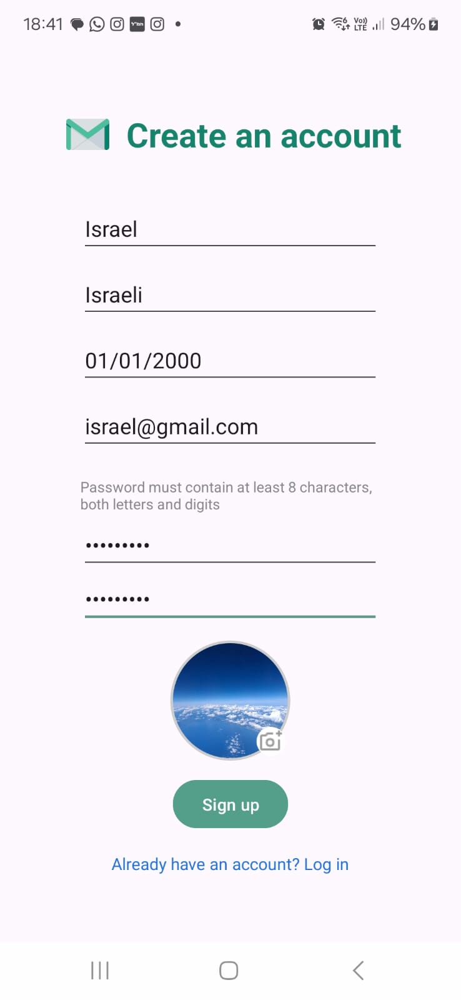
  
  

  
  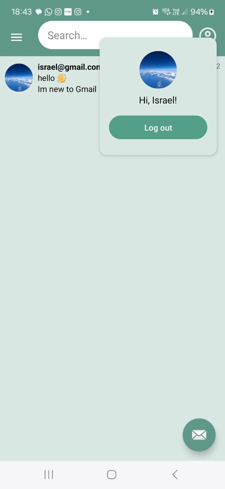
  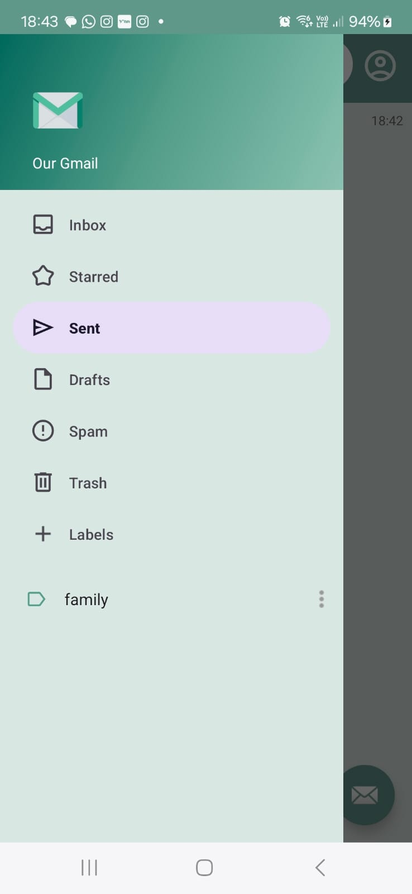
  

  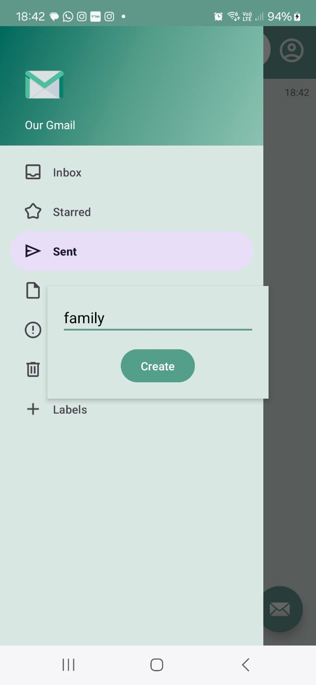
  
  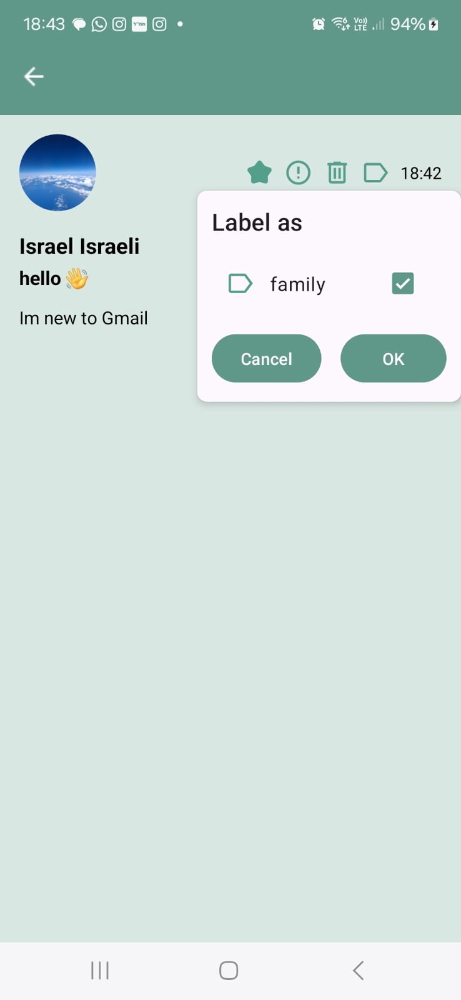
  

  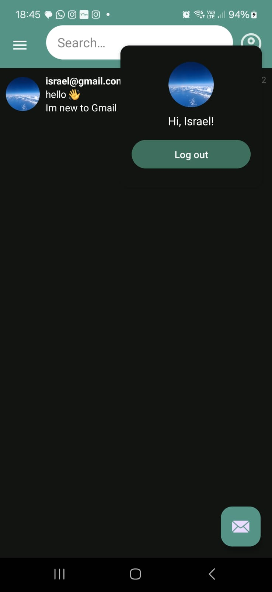
  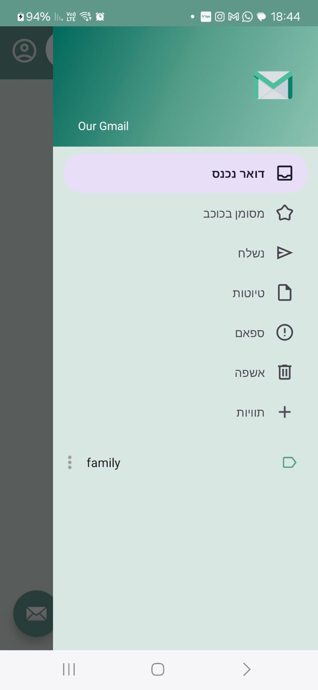
  
  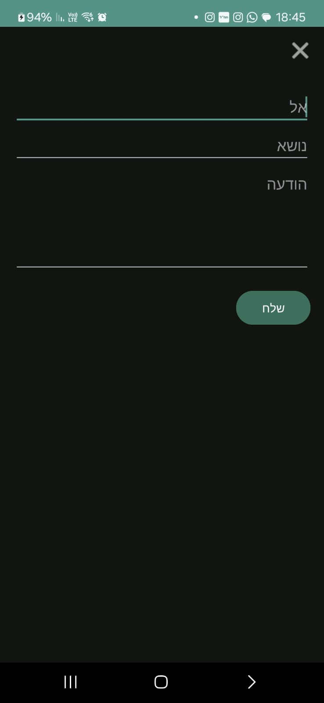

**About Web Application**
The application includes the following screens:
- Login screen
- Registration screen
- Main screen

The app supports the following functionality:
- Displaying the inbox, labels, and menus
- Viewing full details of an email, composing and sending new emails, editing, deleting, etc.
- Searching emails and displaying search results

Additionally, just like in Gmail, the app allows users to star emails, move them to Trash or Spam.
A dark mode version of the application is also available, and can be activated by clicking the moon icon at the top left corner of the screen.

Note: If two users are connected simultaneously, one must use incognito mode.

## Images
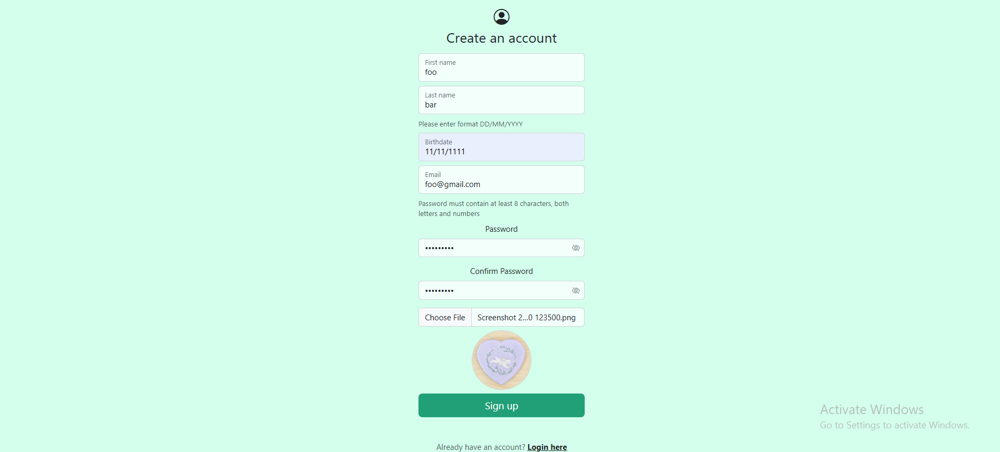

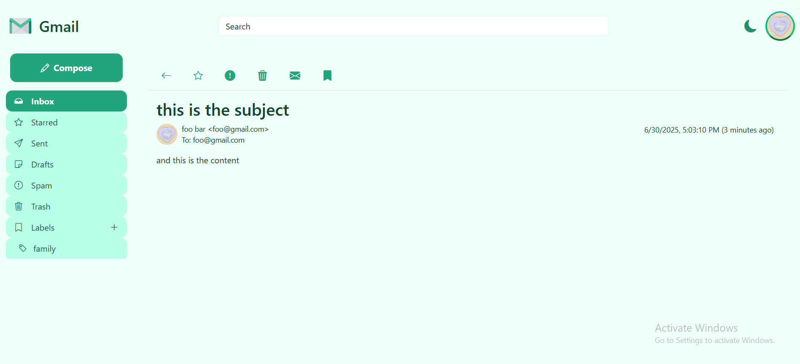

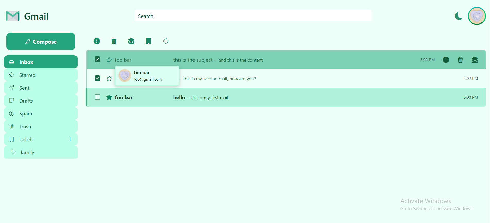
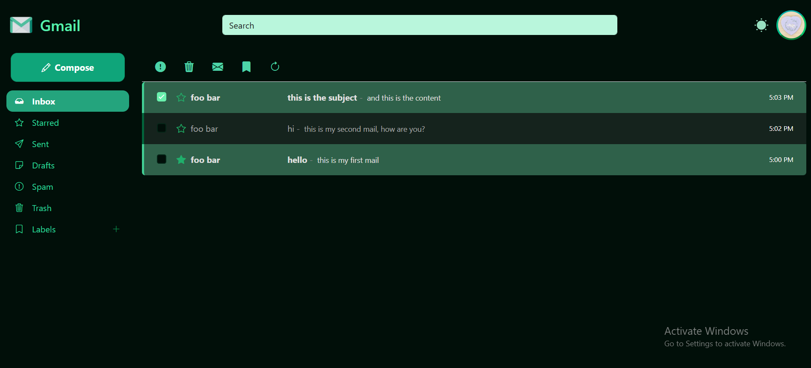
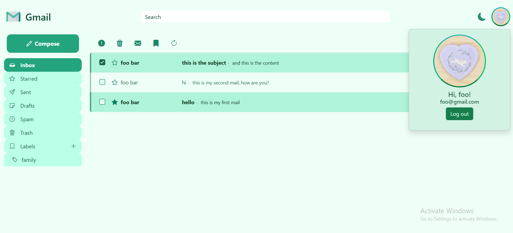

**About Web server**
This program implements NodeJS server using MVC architecture. The information is stored in the server "in memory".
The server implements RESTful API
At this point of the project, the View is not relevant, because we are returning json directly.
The server from exercise 2 will handle each client with a separate thread, so that we can run as many clients as we want at the same time, and all clients can communicate with the server.
Our server will support the functionality of the Gmail application and will provide the following services:
- Login screen
- Registration screen
- Main screen (inbox)

The program enables user registration, mails and labels creation, and adding or deleting URLs from the blacklist.

**About Blacklist server**
This program implements URL filtering system.
We decided to implement a Command Design Pattern, using the classes AddURLToBlacklist & CheckURLInBlacklist to interact with the Database class.
The program is invoked through the server.cpp, where an instance of App class is created. 
The run method in App is in charge of executing the commands. While the class Menu makes sure that the input from the user is valid.

We will be using TCP Protocol:
- The server will be implemented in CPP
- The client will be implemented in python3

While running the server, the user should input the parameters for bloomfilter.
The client connects to the server after the server's creation. It should get the following arguments: ip, port.
The client will be in charge of receiving the input from the user and communicating with the server. 

Afterwards the user has 3 options:
1. add URL to Blacklist
2. check if URL is in Blacklist
3. delete URL from blacklist

The URLs the user decides to add to the blacklist are saved into blacklistFile.txt, which is located in data folder. 
Upon launch, the program looks for the file, if it doesn't exist in data folder, it will be created when the user adds the first URL. 

## Images

## Helpers
**Commands to help with deamon error**
docker compose down --remove-orphans

and then run server again