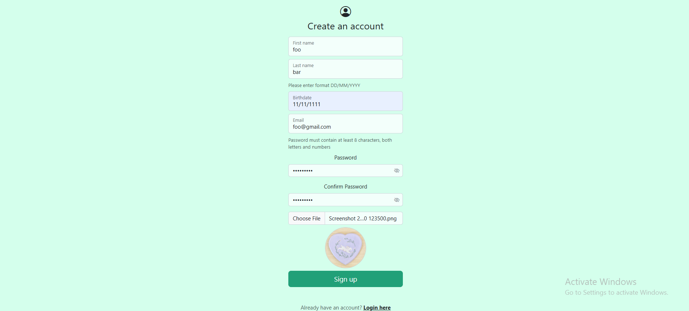
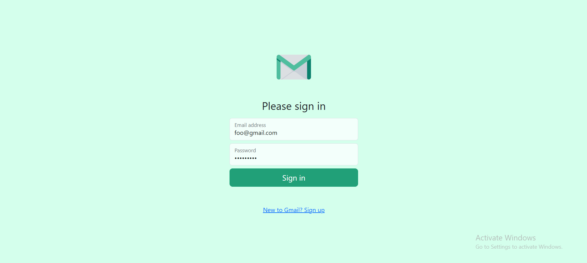
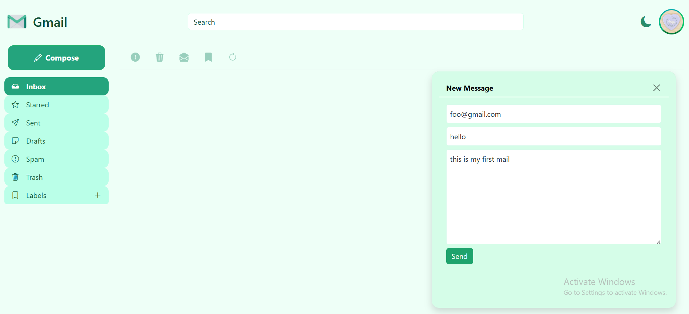
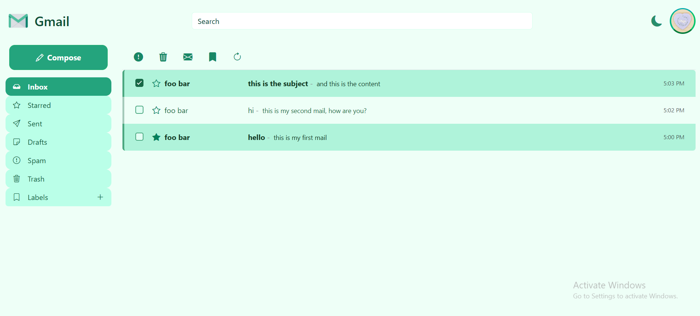
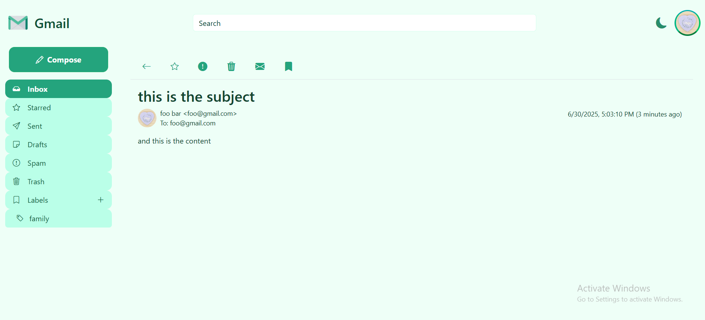
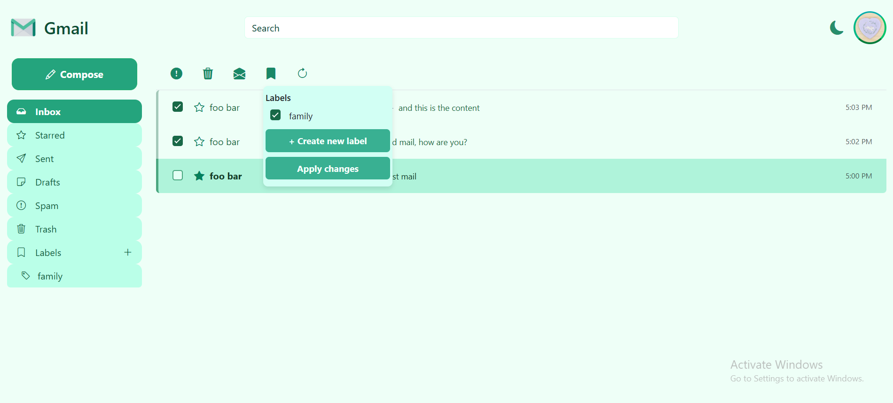
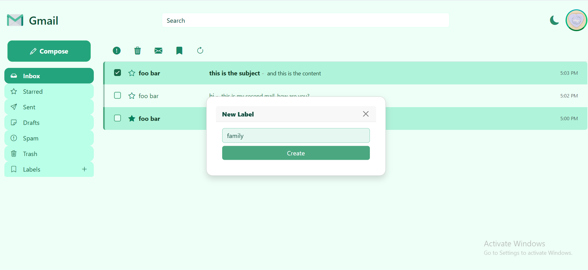
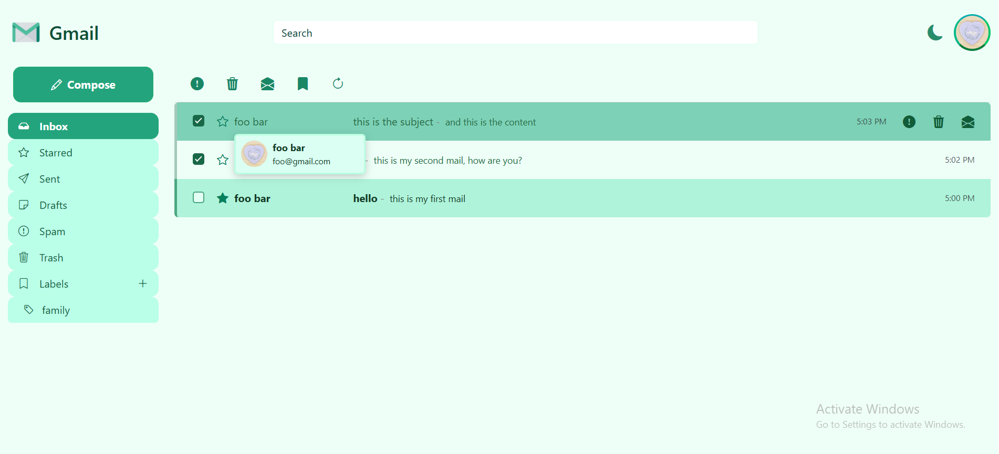
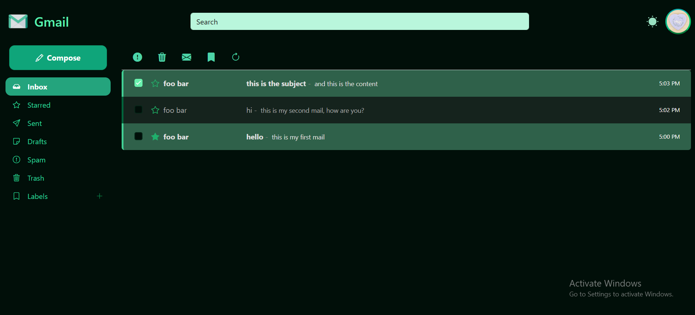
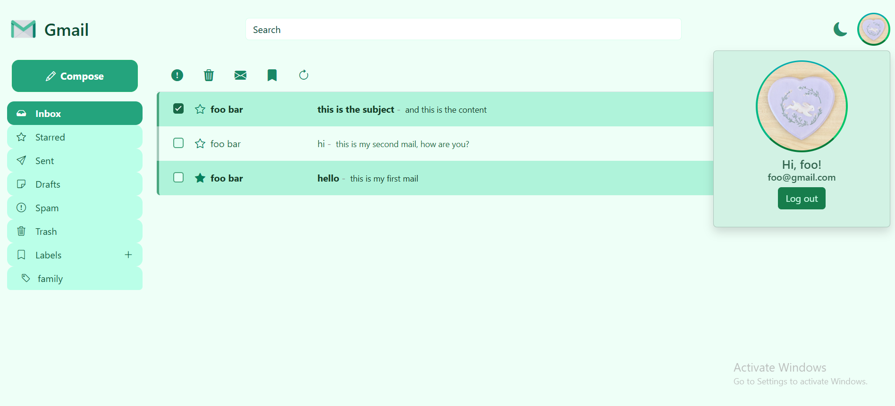

## About Web Application
The application includes the following screens:
- Login screen
- Registration screen
- Main screen

The app supports the following functionality:
- Displaying the inbox, labels, and menus
- Viewing full details of an email, composing and sending new emails, editing, deleting, etc.
- Searching emails and displaying search results

## Getting Started
1. Sign Up
To begin, create a new account by clicking the "New to Gmail? Sign Up" link on the login page.
You will be redirected to the sign-up screen, where you can enter your personal details.

Please note the following input requirements:
- First and last names must contain only alphabetic characters.
- Date of birth must follow the format DD/MM/YYYY.
- Username must be unique.
- Password must be at least 8 characters long and include both letters and digits.

You may optionally upload a profile image from your device. If no image is selected, a default profile picture will be assigned.

2. Login
After completing the registration, you will be redirected to the login screen.
Enter your email and password to access your account.
Upon successful login, your inbox will be displayed.

3. Sending Emails
You can compose and send emails to any existing user, including yourself, by clicking the "Compose" button located in the top of the left menu.

4. Viewing and Managing Emails
To view full details of an email, simply tap on it.
Within the email view, you can perform various actions:
- Star the email
- Move to Trash
- Mark as Spam
- Assign Labels

You can perform these actions on multiple emails simultaneously using the bulk actions bar located at the top of the mailbox.

5. Searching and Filtering
Use the search bar at the top of the screen to find emails by keywords.
You can also filter emails using the side menu, which allows you to view messages by category:
- Inbox
- Sent
- Drafts
- Spam
- Labels

To create a new custom label, click the "+" icon next to the Labels section.

Also, a dark mode version of the application is also available, and can be activated by clicking the moon icon at the top left corner of the screen.

Note: If two users are connected simultaneously, one must use incognito mode.

## Images

